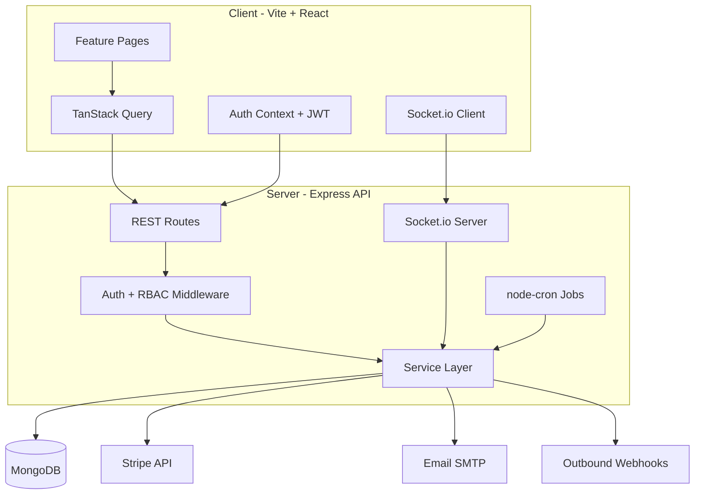

# Smart Leads Dashboard

A **production-style Lead Management CRM** built as a multi-tenant SaaS application. Manage leads, teams, pipelines, and billing in one place — with role-based access, real-time updates, and enterprise-ready patterns.

**Live demo:** [https://smart-leads-blue.vercel.app/](https://smart-leads-blue.vercel.app/)


---

## Table of contents

- [Overview](#overview)
- [Features](#features)
- [Tech stack](#tech-stack)
- [Architecture](#architecture)
- [Prerequisites](#prerequisites)
- [Setup instructions](#setup-instructions)
- [Docker setup](#docker-setup)
- [Demo accounts](#demo-accounts)
- [Usage examples](#usage-examples)
- [API reference](#api-reference)
- [Testing](#testing)
- [Environment variables](#environment-variables)
- [Deployment](#deployment)
- [Project structure](#project-structure)
- [Roadmap](#roadmap)
- [License](#license)

---

## Overview

**Smart Leads Dashboard** helps sales teams capture, qualify, and close leads. Admins get full org control — team invites, assignments, audit logs, webhooks, and billing. Sales users see only their assigned leads.

The project demonstrates:

- Full **MERN** stack with **TypeScript** end-to-end
- **Multi-tenant** organizations with org switching
- **RBAC** (Admin / Sales) at API and query level
- **Real-time** notifications via Socket.io
- **CI/CD** with Jest unit tests and Playwright E2E
- **Docker** for local and production-like runs

| URL | Purpose |
|-----|---------|
| [https://smart-leads-blue.vercel.app/](https://smart-leads-blue.vercel.app/) | **Live demo** (frontend + mock data) |
| http://localhost:5173 | Web application (local) |
| http://localhost:5000/api/docs | Swagger API documentation (local backend) |
| http://localhost:5000/api/health | Health check (local backend) |

---

## Features

### Core CRM

| Feature | Description |
|---------|-------------|
| **Authentication** | JWT-based login/register with bcrypt password hashing |
| **Lead CRUD** | Create, read, update, delete leads with validation |
| **Filters & search** | Status, source, assignee filters + debounced text search |
| **Sorting & pagination** | Server-side pagination for large lead lists |
| **CSV export** | Download filtered leads as CSV |
| **Activity timeline** | Automatic log of lead changes per record |
| **Lead detail** | Full profile with notes, activities, and metadata |

### Pipeline & productivity

| Feature | Description |
|---------|-------------|
| **Kanban board** | Drag-and-drop leads across status columns (`New` → `Contacted` → `Qualified` → `Lost`) |
| **Lead scoring** | Rule-based score (0–100) from status, source, and contact data |
| **Bulk actions** | Multi-select leads → change status or assignee |
| **CSV import** | Upload CSV with validation and error reporting |
| **Command palette** | Press `Ctrl+K` to search leads and jump to pages |
| **Soft delete** | Archive leads; admins can restore from archived view |

### Team & SaaS

| Feature | Description |
|---------|-------------|
| **Multi-tenant orgs** | Each organization has isolated data; users can belong to multiple orgs |
| **Org switcher** | Switch active organization without re-login |
| **Team invites** | Admin sends email invite links for new sales members |
| **Lead assignment** | Admin assigns leads; sales users see only their pipeline |
| **Notes** | Threaded notes on each lead detail page |
| **Audit log** | Admin-only org-level history of sensitive actions |
| **Webhooks** | Outbound `lead.created` / `lead.updated` events for Zapier-style integrations |
| **White-label branding** | Custom org display name and primary color |

### Security & account

| Feature | Description |
|---------|-------------|
| **Email verification** | Verify email on register (skippable in dev) |
| **Password reset** | Forgot-password flow with expiring tokens |
| **2FA (TOTP)** | Google Authenticator–compatible two-factor auth |
| **Rate limiting** | API protection (500 requests / 15 minutes per IP) |

### Analytics & automation

| Feature | Description |
|---------|-------------|
| **Dashboard analytics** | Lead stats, charts, week-over-week comparison (Recharts) |
| **Stale lead reminders** | Daily cron job flags leads with no update for 7+ days |
| **Real-time notifications** | Socket.io push to user and org rooms |
| **Global search** | `GET /search?q=` for quick lead lookup |

### Billing & localization

| Feature | Description |
|---------|-------------|
| **Stripe checkout** | Test-mode subscription upgrade (mock fallback when keys unset) |
| **Plans** | Free, Pro, Enterprise tiers |
| **i18n** | English and Hindi UI via `react-i18next` |
| **Dark mode** | Theme toggle persisted in browser |
| **PWA manifest** | Installable app shell |

### Developer experience

| Feature | Description |
|---------|-------------|
| **Swagger docs** | Interactive API docs at `/api/docs` |
| **Jest API tests** | In-memory MongoDB with Supertest |
| **Playwright E2E** | Login, leads, command palette smoke tests |
| **GitHub Actions CI** | Build, unit tests, and E2E on every push/PR |
| **Docker Compose** | One-command MongoDB + API + client |

---

## Tech stack

| Layer | Technologies |
|-------|----------------|
| **Frontend** | React 19, Vite 8, TypeScript, Tailwind CSS 4, TanStack Query, React Router 7, React Hook Form + Zod, cmdk, Recharts, @dnd-kit, Socket.io client, i18next |
| **Backend** | Node.js, Express 4, TypeScript, Mongoose 8, Zod validation, JWT, bcrypt, Socket.io, node-cron, Stripe, Nodemailer, Swagger |
| **Database** | MongoDB (local, Atlas, or Docker) |
| **Testing** | Jest, Supertest, mongodb-memory-server, Playwright |
| **DevOps** | Docker, Docker Compose, GitHub Actions |

---

## Architecture



### Request flow (example: list leads)

1. Client sends `GET /api/leads` with `Authorization: Bearer <token>`.
2. `auth.middleware` verifies JWT and attaches `userId`, `orgId`, `role`.
3. `lead.service` builds a MongoDB filter scoped to `organizationId`.
4. If role is `sales`, filter further restricts to `assignedTo` or `createdBy` = current user.
5. Paginated results return to the client; TanStack Query caches the response.

---

## Prerequisites

- **Node.js** 20+ (LTS recommended)
- **npm** 9+
- **MongoDB** 7+ (local install, [MongoDB Atlas](https://www.mongodb.com/atlas), or Docker)
- **Git**

Optional:

- Docker & Docker Compose (for containerized setup)
- Stripe test keys (for real checkout flow)
- SMTP credentials (for sending emails; dev mode logs links to console)

---

## Setup instructions

### 1. Clone the repository

```bash
git clone https://github.com/your-org/smart-leads-dashboard.git
cd smart-leads-dashboard
```

### 2. Install dependencies

```bash
cd server && npm install
cd ../client && npm install
```

### 3. Configure environment

**Server** — copy and edit:

```bash
cp server/.env.example server/.env
```

**Client** — copy and edit:

```bash
cp client/.env.example client/.env
```

Minimum server `.env`:

```env
NODE_ENV=development
PORT=5000
MONGO_URI=mongodb://localhost:27017/smart-leads
JWT_SECRET=your-super-secret-key-change-in-production-min-32-chars
JWT_EXPIRES_IN=7d
CLIENT_URL=http://localhost:5173
SKIP_EMAIL_VERIFICATION=true
```

Minimum client `.env`:

```env
VITE_API_URL=http://localhost:5000/api
```

### 4. Start MongoDB

**Option A — Local MongoDB**

Ensure MongoDB is running on `localhost:27017`.

**Option B — Docker (MongoDB only)**

```bash
docker run -d -p 27017:27017 --name smart-leads-mongo mongo:7
```

### 5. Seed demo data

```bash
cd server
npm run seed
```

This creates demo users, an organization, and 12 sample leads.

### 6. Run development servers

**Terminal 1 — API:**

```bash
cd server
npm run dev
```

API runs at **http://localhost:5000**

**Terminal 2 — Client:**

```bash
cd client
npm run dev
```

App runs at **http://localhost:5173**

### 7. Verify

- Open http://localhost:5173 and log in with demo credentials (below).
- Open http://localhost:5000/api/docs for Swagger.
- Open http://localhost:5000/api/health — should return `{ "status": "ok" }`.

---

## Docker setup

Run the full stack (MongoDB + API + client) with one command:

```bash
docker compose up --build
```

| Service | Port | Description |
|---------|------|-------------|
| `mongo` | 27017 | MongoDB 7 with persistent volume |
| `server` | 5000 | Express API |
| `client` | 5173 | Nginx serving built React app |

After containers are healthy, seed the database (one-time):

```bash
docker compose exec server npm run seed
```

Then open http://localhost:5173.

---

## Demo accounts

Use these on the [live demo](https://smart-leads-blue.vercel.app/) or after running locally / with seed data:

| Email | Password | Role | What you can do |
|-------|----------|------|-----------------|
| `admin@smartleads.com` | `password123` | **Admin** | Full access: all leads, team, audit, webhooks, billing, archive/restore |
| `sales@smartleads.com` | `password123` | **Sales** | Only assigned/own leads; no audit or admin settings |

**Organization:** Smart Leads HQ (Pro plan in seed data)

---

## Usage examples

### Example 1 — Admin workflow

1. Log in as `admin@smartleads.com`.
2. Open **Dashboard** — view lead stats and week-over-week charts.
3. Go to **Leads** — filter by status `New`, search by name.
4. Open a lead → add a **note**, change status to `Contacted`.
5. Open **Kanban** — drag a card from `New` to `Qualified`.
6. Press **Ctrl+K** — type a lead name and jump to detail.
7. Go to **Team** — invite a new sales member by email.
8. Go to **Settings** — update org branding color and display name.

### Example 2 — Sales user workflow

1. Log in as `sales@smartleads.com`.
2. **Leads** list shows only leads assigned to you (or created by you).
3. Update lead status, add notes, export your pipeline to CSV.
4. Kanban board reflects only your visible leads.

### Example 3 — CSV import (admin)

1. Go to **Leads** → **Import**.
2. Upload a CSV with columns: `name`, `email`, `status`, `source`.
3. Review validation errors, then confirm import.

### Example 4 — Enable 2FA

1. Log in → **Settings** → **Security**.
2. Scan QR code with Google Authenticator.
3. Enter TOTP code to verify.
4. Next login requires password + 6-digit code.

### Example 5 — API with curl

```bash
# Login
curl -X POST http://localhost:5000/api/auth/login \
  -H "Content-Type: application/json" \
  -d '{"email":"admin@smartleads.com","password":"password123"}'

# List leads (replace TOKEN)
curl http://localhost:5000/api/leads?page=1&limit=10 \
  -H "Authorization: Bearer TOKEN"

# Global search
curl "http://localhost:5000/api/search?q=rahul" \
  -H "Authorization: Bearer TOKEN"
```

---

## API reference

Base URL: `http://localhost:5000/api`

Full interactive docs: **http://localhost:5000/api/docs**

### Auth (`/auth`)

| Method | Endpoint | Auth | Description |
|--------|----------|------|-------------|
| POST | `/register` | Public | Register user + default org |
| POST | `/login` | Public | Login; returns JWT (or 2FA challenge) |
| GET | `/me` | JWT | Current user + refresh token |
| POST | `/switch-org` | JWT | Switch active organization |
| GET | `/verify-email` | Public | Verify email token |
| POST | `/forgot-password` | Public | Send reset email |
| POST | `/reset-password` | Public | Reset with token |
| POST | `/2fa/setup` | JWT | Generate TOTP secret + QR |
| POST | `/2fa/verify` | JWT | Enable 2FA |

### Leads (`/leads`)

| Method | Endpoint | Auth | Description |
|--------|----------|------|-------------|
| GET | `/` | JWT | List with filters, search, pagination |
| POST | `/` | JWT | Create lead |
| GET | `/stats` | JWT | Dashboard statistics |
| GET | `/kanban` | JWT | Leads grouped by status |
| GET | `/export` | JWT | CSV download |
| POST | `/import` | JWT | CSV upload |
| POST | `/bulk` | JWT | Bulk status/assign update |
| GET | `/archived` | JWT + Admin | Soft-deleted leads |
| GET/PATCH/DELETE | `/:id` | JWT | CRUD (delete = admin) |
| PATCH | `/:id/restore` | JWT + Admin | Restore archived lead |
| GET/POST | `/:id/notes` | JWT | Lead notes |
| GET | `/:id/activities` | JWT | Activity timeline |

### Other routes

| Prefix | Description |
|--------|-------------|
| `/organizations` | List/create organizations |
| `/invites` | Team invite management (admin) |
| `/notifications` | In-app notifications |
| `/audit` | Audit log (admin) |
| `/settings` | Org settings, branding, team permissions |
| `/webhooks` | Outbound webhook CRUD (admin) |
| `/billing` | Plans, subscription, Stripe checkout |
| `/search` | Global lead search |

---

## Testing

### Server — Jest (unit/integration)

Uses **mongodb-memory-server** — no real MongoDB required.

```bash
cd server
npm test
```

Covers: health, auth register/login, `/me`, lead CRUD, pagination, billing plans.

### Client — Playwright (E2E)

Starts both API and Vite automatically (see `client/playwright.config.ts`).

```bash
# Ensure MongoDB is running and seeded
cd server && npm run seed

cd ../client
npm run test:e2e
```

Tests: landing page, admin login → leads page, command palette (`Ctrl+K`).

### CI (GitHub Actions)

On every push/PR to `main` or `master`:

1. **server** — `npm ci`, `npm run build`, `npm test`
2. **client** — `npm ci`, `npm run build`
3. **e2e** — MongoDB service, seed DB, Playwright Chromium, full E2E suite

---

## Environment variables

### Server (`server/.env`)

| Variable | Required | Description |
|----------|----------|-------------|
| `NODE_ENV` | Yes | `development` \| `production` \| `test` |
| `PORT` | Yes | API port (default `5000`) |
| `MONGO_URI` | Yes | MongoDB connection string |
| `JWT_SECRET` | Yes | Secret for signing JWTs (32+ chars in production) |
| `JWT_EXPIRES_IN` | No | Token expiry (default `7d`) |
| `CLIENT_URL` | Yes | Frontend URL for CORS and email links |
| `SKIP_EMAIL_VERIFICATION` | No | `true` to skip verify in local dev |
| `SMTP_HOST`, `SMTP_PORT`, `SMTP_USER`, `SMTP_PASS` | No | Email delivery |
| `EMAIL_FROM` | No | Sender address |
| `STRIPE_SECRET_KEY` | No | Stripe test secret (mock billing if unset) |
| `STRIPE_WEBHOOK_SECRET` | No | Stripe webhook verification |
| `STRIPE_PRICE_PRO`, `STRIPE_PRICE_ENTERPRISE` | No | Stripe price IDs |

### Client (`client/.env`)

| Variable | Required | Description |
|----------|----------|-------------|
| `VITE_API_URL` | Yes | API base URL (e.g. `http://localhost:5000/api`) |

---

## Deployment

**Live demo:** [https://smart-leads-blue.vercel.app/](https://smart-leads-blue.vercel.app/) — hosted on Vercel with `VITE_DEMO_MODE=true` (no backend required).

See [DEPLOY_GUIDE.md](./DEPLOY_GUIDE.md) to deploy your own copy.

**Full stack (optional):** use `render.yaml` for API + MongoDB Atlas.

Recommended production setup:

| Component | Platform | Notes |
|-----------|----------|-------|
| **Frontend** | [Vercel](https://vercel.com) | Root: `client/`, env: `VITE_API_URL` |
| **Backend** | [Railway](https://railway.app) or [Render](https://render.com) | Root: `server/`, set all server env vars |
| **Database** | [MongoDB Atlas](https://www.mongodb.com/atlas) | Free tier works for demos |

**Checklist before go-live:**

- [ ] Set strong `JWT_SECRET`
- [ ] Set `NODE_ENV=production`
- [ ] Configure `CLIENT_URL` to your frontend domain
- [ ] Enable MongoDB Atlas IP allowlist / VPC
- [ ] Set `SKIP_EMAIL_VERIFICATION=false` and configure SMTP
- [ ] Add Stripe live/test keys for billing
- [ ] Run `npm run build` on both client and server

---

## Project structure

```
smart-leads-dashboard/
├── client/                 # React frontend
│   ├── src/
│   │   ├── app/            # Router, providers, auth context
│   │   ├── features/       # auth, leads, dashboard, team, billing, ...
│   │   ├── components/     # layout, UI, CommandPalette
│   │   ├── lib/            # axios api, socket
│   │   └── i18n/           # en.json, hi.json
│   ├── e2e/                # Playwright tests
│   └── public/             # PWA manifest
├── server/                 # Express API
│   └── src/
│       ├── routes/         # Route definitions
│       ├── controllers/    # HTTP handlers
│       ├── services/       # Business logic
│       ├── models/         # Mongoose schemas
│       ├── middleware/     # auth, rbac, validate
│       ├── jobs/           # Cron (stale leads)
│       ├── socket/         # Real-time
│       └── __tests__/      # Jest tests
├── docker-compose.yml
├── .github/workflows/ci.yml
└── README.md
```

---

## Roadmap

- [ ] OAuth (Google / GitHub)
- [ ] Redis caching + per-org rate limits
- [ ] Elasticsearch full-text search
- [ ] AI email draft suggestions
- [ ] PDF report export
- [ ] Visual regression tests in CI

---

## License

This project is for portfolio and learning purposes. Update the license section when you publish to a public repository.

---

**Built with** React · Vite · Tailwind · TanStack Query · Express · Mongoose · TypeScript · Socket.io · Playwright · Jest
